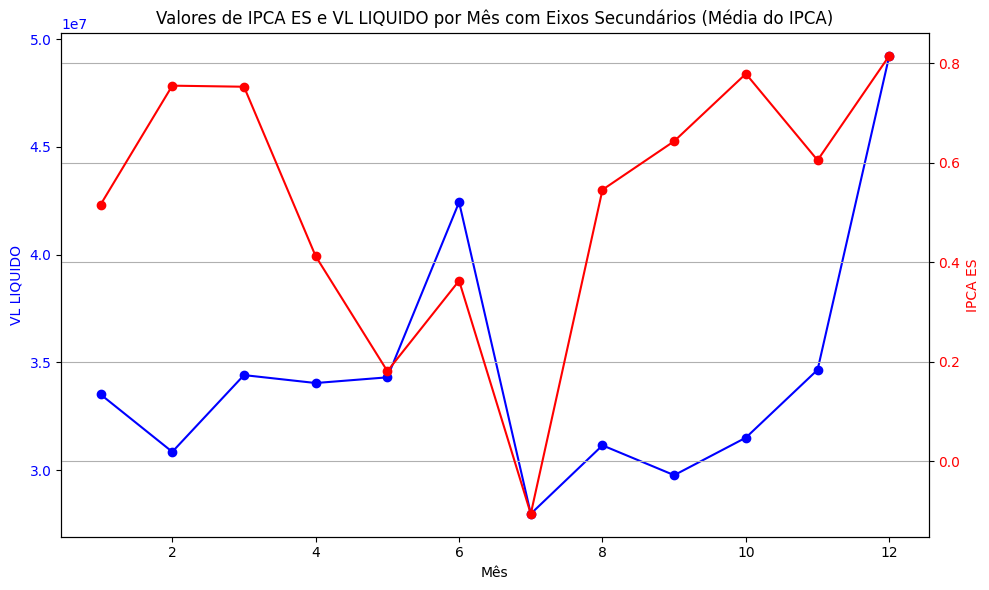
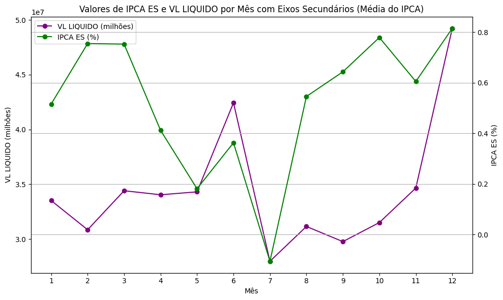

# Atividade ponderada 2 de UX

Este repositório é dedicado à atividade ponderada "Atividade 2 de UX com pontuação desenvolvida em sala", correspondente à oitava semana do módulo três do Inteli - Instituto de Tecnologia e Liderança. O foco desta atividade é a Experiência do Usuário (UX), mais especificamente o storytelling de dados e user experience. Neste contexto, apresentamos um gráfico do nosso projeto para um colega, que nos forneceu feedback com sugestões de melhorias. Agora, vamos aplicar essas melhorias e demonstrar o "antes e depois".

## Gráfico Atual

Figura 01 - Gráfico atual
 

 
Fonte: Material produzido pelos autores (2024)

## Feedbacks Recebidos

Os principais apontamentos feitos pelo colega foram:

- Inclusão de mais meses, já que há espaço disponível;
- Adição de uma legenda que identifique a cor de cada linha;
- Indicação clara da escala utilizada (centenas, milhares, milhões, porcentagem);
- Substituição das cores (vermelho e azul) que passam a impressão de "bom e ruim", quando o objetivo é apenas comparar;
- Remoção da coloração nos valores das escalas.

## Proposta de Novo Gráfico

Com base nesses feedbacks, desenvolvemos a seguinte proposta de melhoria:

Figura 02 - Proposta de gráfico
 

 
Fonte: Material produzido pelos autores (2024)

Corrigimos os apontamentos feitos: incluímos todos os meses, adicionamos uma legenda explicativa, inserimos informações sobre a escala, ajustamos as cores para evitar associações subjetivas e removemos as cores dos valores da escala. Esperamos que essa proposta seja mais coerente e agradável, demonstrando uma evolução em comparação ao gráfico anterior. Este novo gráfico será apresentado ao grupo para discutirmos se a mudança será aplicada ou não.
